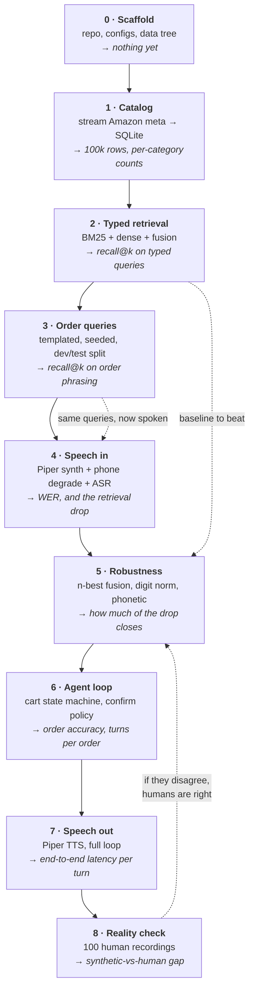

# Architecture

> The visual version of this document is
> [`voice-order-agent.drawio`](voice-order-agent.drawio) — four pages, openable at
> [app.diagrams.net](https://app.diagrams.net) or with the Draw.io VS Code extension.
> This file is the same content in text, for reading inline on GitHub.

Two things live in this repo: a **runtime** that takes a call and writes an
order, and an **eval harness** that decides whether the runtime works. They
share the retrieval core and nothing else.

---

## 1. The system

```mermaid
flowchart LR
    subgraph runtime["Runtime — one phone call"]
        direction LR
        MIC["Caller audio<br/>8 kHz mono"] --> ASR["ASR<br/>faster-whisper<br/>n-best hypotheses"]
        ASR --> AGENT["Agent loop<br/>intent · cart · confirm"]
        AGENT --> RET["Retrieval"]
        RET --> AGENT
        AGENT --> TTS["TTS<br/>Piper"]
        TTS --> SPK["Caller hears reply"]
    end

    subgraph core["Retrieval core — in-process"]
        direction TB
        LEX["BM25<br/>data/index/bm25/"]
        PN["Part-number matcher<br/>digit-normalised + phonetic"]
        DEN["Dense<br/>embeddings.npy, brute force"]
        FUSE["Fusion + rerank<br/>over all ASR hypotheses"]
        LEX --> FUSE
        PN --> FUSE
        DEN --> FUSE
    end

    subgraph db["SQLite — storage only"]
        direction TB
        P[("products")]
        PPN[("product_part_numbers")]
        C[("calls")]
        CT[("carts")]
        O[("orders")]
    end

    RET -.-> core
    FUSE -.->|"hydrate ids"| P
    P -.->|"index build"| LEX
    P -.->|"index build"| DEN
    PPN -.->|"index build"| PN
    AGENT --> CT
    AGENT --> O
    AGENT --> C```

The whole design turns on one claim: **speech destroys exactly the tokens
that retrieval depends on.** `41-993` becomes "forty one dash nine ninety
three" becomes `4199 3`. So the retrieval core never sees one string — it
sees the ASR's whole n-best list, and it matches part numbers on a
normalised, phonetic representation rather than on characters.

## 2. One turn, end to end

```mermaid
sequenceDiagram
    participant Caller
    participant ASR
    participant Agent
    participant Retrieval
    participant DB as SQLite

    Caller->>ASR: "I need an AC Delco 41-993"
    ASR->>Agent: n-best: ["...41-993", "...forty one 99 3", "...4199 three"]
    Agent->>Retrieval: query all hypotheses
    Retrieval->>Retrieval: BM25 + vector + part-number, in-process
    Retrieval->>DB: hydrate winning ids
    DB-->>Retrieval: product rows
    Retrieval-->>Agent: ranked candidates + confidence

    alt confident
        Agent->>DB: add to cart
        Agent->>Caller: "Added one AC Delco 41-993. Anything else?"
    else ambiguous
        Agent->>Caller: "Did you mean AC Delco 41-993 spark plug?"
        Caller->>Agent: "yes"
        Agent->>DB: add to cart
    end

    Note over Agent,DB: every turn writes transcript + candidates,<br/>so a wrong order is traceable to ASR or retrieval
```

The confirmation turn is not politeness. It is the mechanism that converts a
low-confidence retrieval into either a correct order or a cheap re-ask,
instead of a silently wrong one.

## 3. Build order

Each stage ends with a **number**, not a feature. If a stage does not produce
a number, it is not done. Nothing downstream starts until the number exists,
because otherwise there is no way to tell which stage caused a regression.



### What each stage actually is

| # | stage | builds | done when |
|---|---|---|---|
| 0 | Scaffold | `data/`, `configs/`, package skeleton, gitignore rules | `voice-order --help` runs |
| 1 | Catalog | stream `meta_*.jsonl` → normalise → `products` + `product_part_numbers` | 100k rows loaded, category counts match `configs/catalog.yaml`, and identifier coverage splits Automotive from Health |
| 2 | Typed retrieval | on-disk BM25 index, embeddings.npy, RRF fusion; eval on fitment-rag lookup queries | recall@1/@5/@20 per category, typed input, no audio anywhere |
| 3 | Order queries | seeded generator: quantities, brands, part numbers, disfluencies; fixed dev/test split | the same recall metrics, now on order phrasing — the gap vs stage 2 answers open question #2 |
| 4 | Speech in | Piper synthesis over 4+ voices, ffmpeg phone codec, MUSAN mixing, faster-whisper n-best | WER clean vs phone, **and** recall@k through ASR — the drop from stage 3 is the headline problem |
| 5 | Robustness | digit normalisation, phonetic part-number matching, retrieval over n-best rather than 1-best | how much of the stage-4 drop is recovered; ablate each of the three |
| 6 | Agent loop | intent parsing, cart state machine, confidence threshold → confirm or commit, `orders` write with full trace | order accuracy end to end, and turns-per-order as the cost of confirming |
| 7 | Speech out | Piper reply synthesis, barge-in, timing instrumentation | p50/p95 latency per turn, broken down by ASR / retrieval / TTS |
| 8 | Reality check | ~100 human recordings, some over a real phone line | synthetic-vs-human delta on the stage-5 metrics |


### Rules that hold across every stage

- **Dev decides, test reports.** Configuration is chosen on dev. Test is run
  once, at the end of a stage, and not looked at while deciding anything.
- **Per-category, never one average.** Automotive and Health_and_Household
  are in the slice precisely because they behave differently. An average
  hides the only interesting result.
- **Every order stores its trace.** Transcript, n-best, retrieved candidates,
  scores. A wrong order must be attributable to ASR or to retrieval, or the
  failure is just a shrug.
- **Regenerable data is gitignored.** Ground truth is committed. See
  `data/README.md`. The database and the indexes are both derived: delete
  `data/voice_order.db` and `data/index/`, rerun two commands, and you are back.
- **The database stores; it does not rank.** Retrieval is in-process so the
  numbers are identical on every machine, and so stage 5 can ablate a component
  with a constructor flag rather than a schema migration.

## 4. Where the code lives

```
voice_order/
  config.py          typed config loading from configs/*.yaml
  catalog/           stage 1 — stream, normalise, load to SQLite
  db/                SQLite schema, session, repository (the only SQL)
  retrieval/         stages 2 + 5 — lexical, dense, part numbers, fusion
                     (in-process; indexes live in data/index/)
  asr/               stage 4 — faster-whisper wrapper, n-best
  tts/               stage 7 — Piper wrapper
  agent/             stage 6 — state machine, confirmation policy, loop
  evaluation/        stages 2,3,4,5,8 — query gen, audio synth, metrics
  cli.py             one entry point per stage
configs/             catalog / asr / retrieval / agent
docs/                this file
data/                see data/README.md
```
